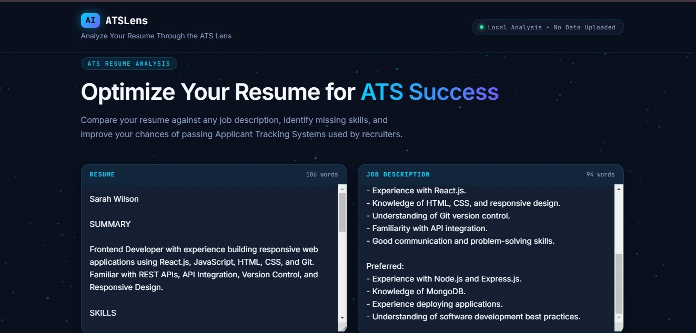
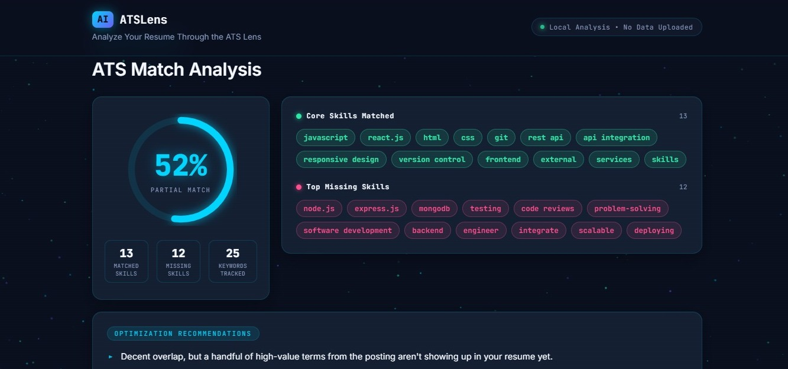

# ATSLens

Analyze your resume through the ATS lens.

ATSLens is a simple web app that compares a resume against a job description, finds matching and missing keywords, and gives you an ATS match score — all in the browser.

## Screenshots

**Home Page**


**ATS Analysis Report**


## Features

- ATS match score
- Matched & missing skills detection
- Resume optimization suggestions
- Interactive dashboard
- Runs fully in the browser — no data uploaded anywhere

## How It Works

1. Paste your resume.
2. Paste the job description.
3. Click **Run ATS Analysis**.
4. ATSLens extracts keywords from the job description, compares them to your resume, and shows your match score along with matched/missing skills and suggestions.

## Example

```text
ATS Match Score: 88%

Matched:
✓ JavaScript
✓ React.js
✓ Node.js
✓ Express.js
✓ MongoDB
✓ Git
✓ REST API

Missing:
✗ Testing
✗ Cloud Platforms
✗ Deployment
```

## Tech Stack

HTML, CSS, JavaScript (vanilla)

## Getting Started

```bash
git clone https://github.com/DAMINI11-blip/ats-lens.git
cd ats-lens
```

Then just open `index.html` in your browser — no installation needed.

## Privacy

Everything runs locally in your browser. Your resume and job description are never uploaded or stored.

## Author

**Damini Reddy**
GitHub: https://github.com/DAMINI11-blip 
